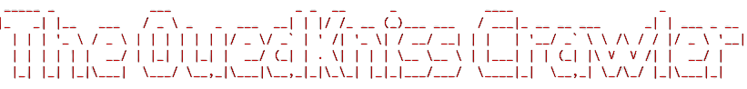
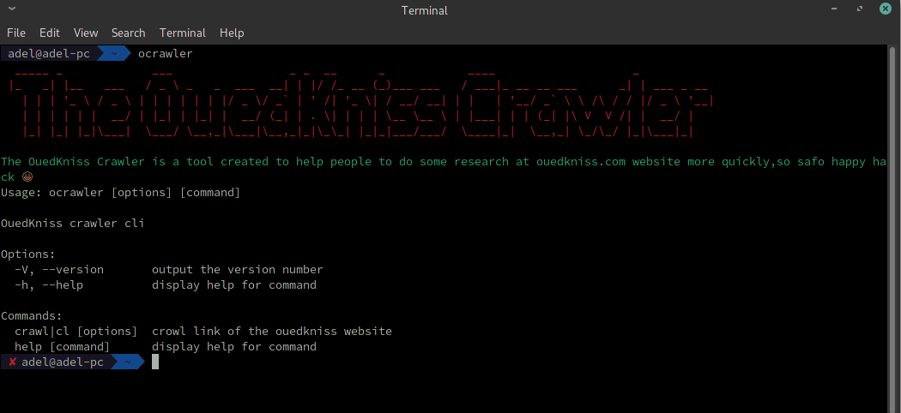
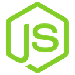

<h1 align="center">
  <br>
  
  <br>
  The OuedKniss Crawler
  <br>
</h1>

<h4 align="center">View Ouedkniss posts faster and get the opportunity that you are looking for!</h4>
<br>


<p align="center">
  <a href="#About-this-project">About this project</a> •
  <a href="#installation">Installation</a> •
  <a href="#basic-usage">Basic usage</a> •
  <a href="#Built-with">Built With</a> •
  <a href="#license">License</a>
</p>

##  About this Project
The OuedKniss Crawler is a tool created to help people to do some research at ouedkniss.com website more quickly by extracting posts's public data and exporting them in a CSV file<br/>


## Installation

To clone and run this repo, you'll need [Git](https://git-scm.com) , [Node.js](https://nodejs.org/en/download/) [Npm](https://npm.com/) installed on your computer. From your command line:

```bash
# Clone this repository
$ https://github.com/TadjerouniMohamedAdel/ouedkniss-crawler.git

# Go into the repository
$ cd ouedkniss-crawler

# Install dependencies
$ npm install

# Installing the script locally 
$ npm link
```

## Basic usage
From your command line: 
```bash
$ ocrawler
```
You will see :<br/><br/>


Then you can execute this interactive command and follow the steps:
```bash
$ ocrawler crawl
```

Or execute the command with the options directly:
```bash
$ ocrawler crawl -l <link of ouedkinss list>
```

## Built With

* NodeJs 
* cheerio 


## License

MIT

---

> [nagatodev.netlify.app](https://nagatodev.netlify.app/) &nbsp;&middot;&nbsp;
> GitHub [@AdelMohamedTadjerouni](https://github.com/TadjerouniMohamedAdel) &nbsp;&middot;&nbsp;
> LinkedIn [@adel_mohamed_tadjerouni](https://www.linkedin.com/in/adel-mohamed-tadjerouni-147546164/)

